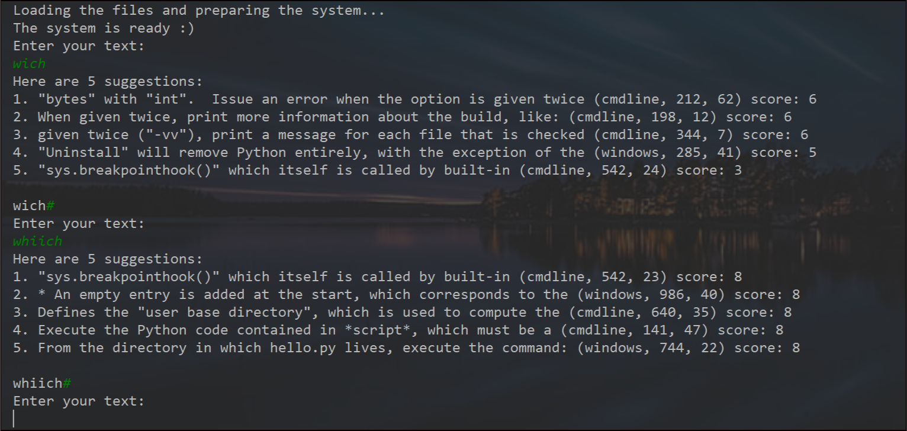

 # Google Project
 ## Automatic Sentence Completion
 
In this project there is an implementation for one feature of Google's search engines - AutoComplete.
AutoComplete, or word completion, is a feature in which an application predicts the rest of the sentence the user is typing.
The purpose of the completion action is to make it easier for the user to find the most appropriate definition for searching.
Once entering some text the user will get the five closest completions to the input.
If there are five sentences that the text is their sub-string, they will be returned. Otherwise will be returned sentences containing the sub-string with one of the changes - a missing letter, additional letter, or a replaced letter.
If the user insert `#`, start a new word to search.

The results will be from sentences within a given directory of text files.
You can use your own directory. in the file `data_manager.py`, change the constant DATA_PATH to your own path.

### Ex1:

### Ex2:

